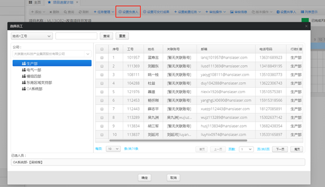

# 项目进度计划

* **单击**项目管理-**双击**项目进度计划进入主界面

### **增加一条项目进度计划**

* 点击**添加-关联项目合同**进入**选择项目合同**页面，点击保存即可新增。

* 注意事项：
  * **`选择项目档案`**`窗口只会显示你能选择的项目`
  * `每条`**`项目合同计划`**`只能关联一条`**`项目合同档案`**\`\`

### **删除一条项目进度计划**

* 选择需删除的项目进度计划，点击**删除**弹出确认框，点击确认即可

* 注意事项：
  * `只有项目进度计划的`**`创建人`**`可以删除项目进度计划。`
  * `只能删除`**`【正在制定】`**`、`**`【已作废】`**`的项目进度计划`

### **检索项目进度计划**

* 点击查询按钮，输入相应的搜索条件，点击查询即可。

* 注意事项：
  * `如需清空条件，需再次点击查询框，使用空白条件查询，或者关闭页面再次进入`

### **任务管理**

* 双击添加好的**项目进度计划**，进入任务管理界面，任务相关按钮即会变成可点击状态

* 任务管理所有操作都必须在【正在制定】、【本地副本】状态下进行。

#### **添加任务**

点击**任务管理-添加任务**，进入添加任务界面，填写相关数据后点击保存即可。

* 注意事项：
  * `当没有选择任务点击的添加任务时，添加的为根任务，即项目阶段`
  * `当选择任务后点击添加任务时，添加的为被选任务的子任务`
  * `当添加阶段时，阶段时间范围不能超过`**`项目进度计划`**`的总范围`
  * `当添加子任务时，任务时间范围不能超过父任务的范围`
  * `阶段任务不能重复`
  * `任务完成度100%的任务无法添加子任务`

#### **修改任务**

 点击**任务管理-添加任务**，进入修改任务界面，填写相关数据后点击保存即可。

* 注意事项：
  * `如果是阶段任务，只能由阶段负责人以及项目计划创建人修改。`
  * `如果是非阶段任务，只能由任务负责人及上级任务的负责人修改`
  * `修改任务的开始时间，不能在前置任务的结束时间之前`
  * `延长任务的结束时间，会将把该任务作为前置任务的所有任务时间往后推移延长的天数，如果因为推移导致任务超范围（父任务范围、项目进度计划总时间范围），则不允许修改。`

#### **删除任务**

选中需要删除的任务，点击**任务管理-删除任务**，即可。

* 注意事项：
  * `如果是阶段任务，只能由阶段负责人以及项目计划创建人删除。`
  * `如果是非阶段任务，只能由任务负责人及上级任务的负责人删除`
  * `如果被删任务的子任务包含子任务（即被删任务包含孙任务），该任务无法删除，须先删除孙任务后再删除该任务。`

#### **设置负责人**

选中需要设置负责人的任务，点击**设置负责人**，弹出人员选择框。

* 注意事项：
  * `设置权限与修改权限相同，详情见修改任务的注意事项1,2`
  * `只能设置有`**`关联账号`**`的人员`
  * `选择人员窗口只会显示在`**`项目合同档案`**`中成员的部门的人员。`

#### **设置可交付成果**

选中需要设置可交付成果的任务，点击**设置可交付成果**，弹出可交付成果设置框。

* 注意事项：
  * `设置权限与修改权限相同，详情见修改任务的注意事项1,2`
  * `每个任务能设置的可交付成果须预先配置好。`

#### **设置前置任务**

选中需要设置前置任务的任务，点击**设置前置任务**，弹出前置任务设置框。

* 注意事项：
  * `设置权限与修改权限相同，详情见修改任务的注意事项1,2`
  * `如果设置的前置任务结束时间在被选任务的开始时间之后，会将把该任务的所有任务时间往后推移相应的间隔天数，如果因为推移导致任务超范围（父任务范围、项目进度计划总时间范围），则不允许设置。`

#### **清空前置任务**

选中需要清空前置任务的任务，点击**清空前置任务**。

* 注意事项：
  * `设置权限与修改权限相同，详情见修改任务的注意事项1,2`

### **审批相关**

* 审批状态一共分为【正在制定】【审核中】【审核通过】【变更审批中】【已作废】【已完成】
* 新建的所有项目进度计划状态都是【正在制定】
* **提交制定审批**

选中需要提交制定审批的项目进度计划，点击**审批操作-提交制定审批**

* 注意事项：
  * `只有项目进度计划的`**`创建人`**`可以提交审批`
  * `只有【正在制定】状态的项目进度计划可以提交制定审批`
  * `没有添加阶段的项目进度计划无法提交制定审批`
  * `提交制定审批后，项目进度计划版本号+1。`
  * `提交制定审批后，需所有阶段负责人全部审批同意，才能审批通过`
  * `如果有审批人点击拒绝，项目进度计划的审核状态变为【正在制定】，须修正后由创建人再次提交，之前点过同意的审批人再次提交时，无须再次审批。`
  * `选中项目进度计划，点击`**`审核信息`**`，可以看到审核中项目当前审核人的审核情况（同意or拒绝）。`

#### **审核**

选中需要审核的项目进度计划，点击**审批操作-提交制定审批**，弹出审核/处理窗口。

#### **作废**

选中需要作废的项目进度计划，点击**审批操作-作废**，确认窗口，点击确认即可。

* 注意事项：
  * `只有项目进度计划的`**`创建人`**`可以作废项目进度计划。`

#### **完结**

选中需要完结的项目进度计划，点击**审批操作-完结**。

* 注意事项：
  * `只有【审核通过】状态的项目进度计划可以生成副本`
  * `只有项目进度计划所有阶段任务完成度都是100%才能完结该项目。`

#### **提交变更审批**

见版本控制-生成副本

### **版本操作**

#### **生成副本**

**如果需要修改【审批通过】的项目进度计划的任务信息，需先生成版本，然后提交变更审批，审核通过后，变更生效。**

选中需要生成副本的项目进度计划，点击**生成副本**。

* 注意事项：
  * `只有【审核通过】状态的项目进度计划可以生成副本`
  * `生成的副本只有自己的账号可以看到`
  * `当前看到的项目进度计划是否是副本可以看`**`版本`**`列来判断`\`\`
  * `生成的副本需`**`提交变更审批`**`才能使变更生效`
  * `提交变更审批后，版本号+1，副本变为正式版本，状态变为【变更审批中】`
  * `提交变更审批的审批人为所有改动任务的阶段负责人审批。`
  * `提交变更审批后，需所有审批人全部审批同意，才能审批通过，审批通过状态改为【审核通过】`
  * `如果有审批人点击拒绝，项目进度计划重新变为副本，须修正后由副本提交人再次提交，之前点过同意的审批人再次提交时，无须再次审批。`

#### **退回最新版本**

如果生成的副本不想要了，可以点击**版本操作-退回最新版本**，使本地副本变为最新版本，但副本的所有修改都会被取消

#### **历史版本**

选中v2版本以上的项目进度计划，点击**版本操作-历史版本**，可查看所有历史版本信息。

* 注意事项：
  * `历史版本不会显示最新版本`
  * `历史版本只有查看权限`

#### 历史审批信息

选中v2版本以上的项目进度计划，点击**版本操作-历史审批信息**，可查看所有历史审批信息。

* 注意事项
  * `历史审批信息不会显示最新版本`
  * `历史审批信息只有查看权限`

**设置共享人**

如果一个项目进度计划只想给部分人看，这部分人又不是相关任务的负责人，则可以设置共享人，共享人只有查看权限，可查看项目进度计划的所有信息。

选中项目进度计划，点击**设置共享人**，弹出设置共享人窗口，在里面添加、删除即可。

* 注意事项
  * `只有项目进度计划的创建人可以设置共享人`
  * `共享人没有任何添加、删除权限。`

